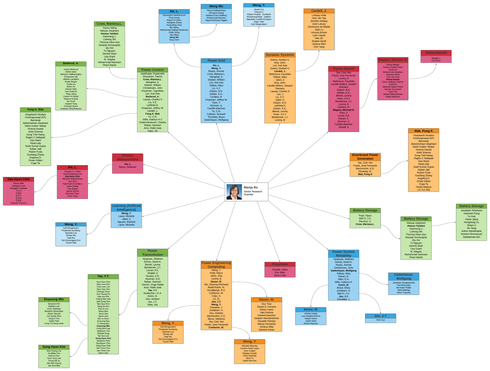
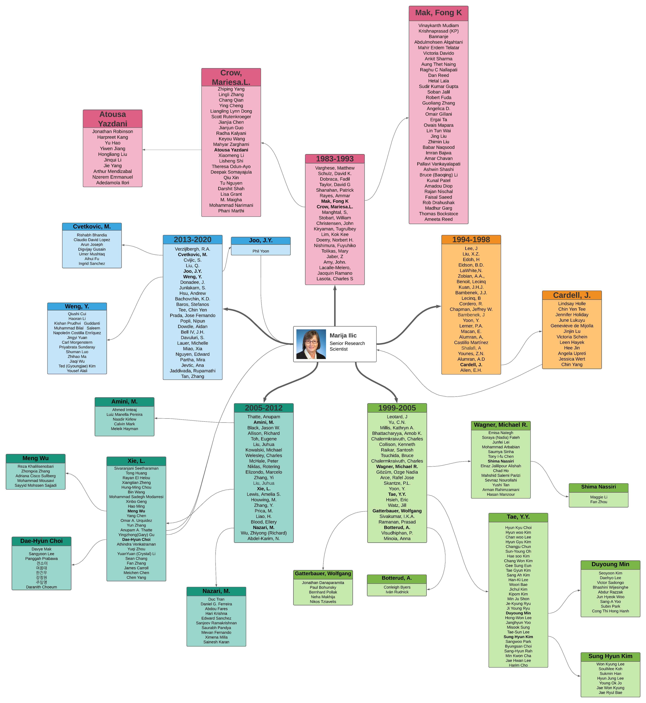

---
# An instance of the Blank widget.
# Documentation: https://wowchemy.com/docs/page-builder/
widget: blank

# This file represents a page section.
headless: true

# Order that this section appears on the page.
weight: 30

subtitle:
title: <h2>Marija's Impacts</h2>
design:
  view: compact
  columns: '1'
---

    

        <figure>
            <a href="./ilic-academic-impact.png" target="_blank">
                
                <figcaption> Marija's academic impact (click to expand) </figcaption>
            </a>
        </figure>
        <figure>
            <a href="./ilic-industrial-impact.png" target="_blank">
                
                <figcaption> Marija's industry impact (click to expand) </figcaption>
            </a>
        </figure>
    

    

        <figure>
            <a href="./ilic-academic-tree.png" target="_blank">
                
                <figcaption> Marija's academic tree (click to expand) </figcaption>
            </a>
        </figure>
    

