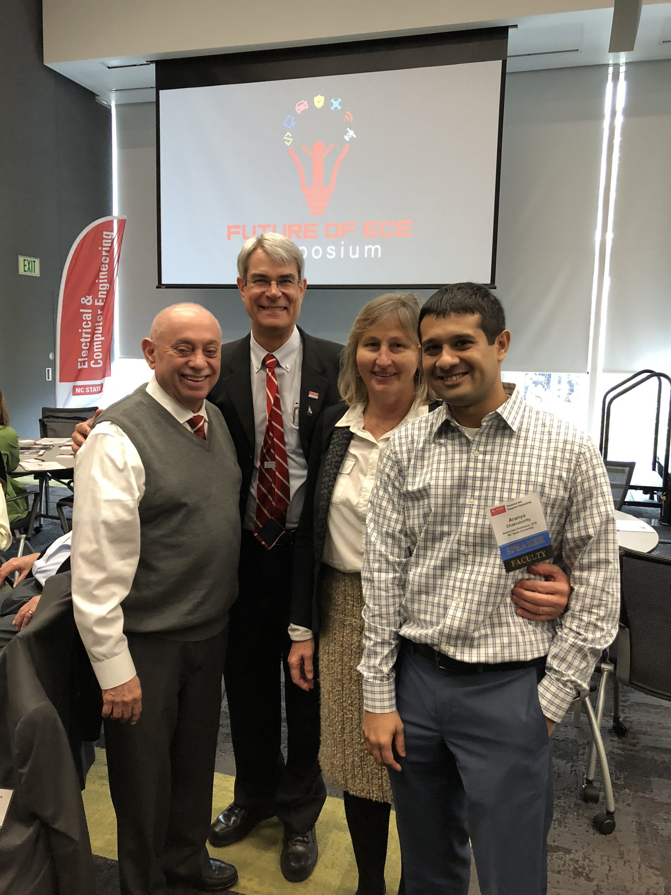

Prof. Marija Ilic was invited to deliver a keynote speech at the Future
Renewable Electric Energy Delivery and Management
([FREEDM](https://www.freedm.ncsu.edu/)) Research Symposium.

<!--more-->
Her presentation titled ‘The Future of Electric Power Grid ‘ can be found [here](https://www.freedm.ncsu.edu/wp-content/uploads/2019/04/Ilic-MIT-Future-of-the-Grid.pdf).

